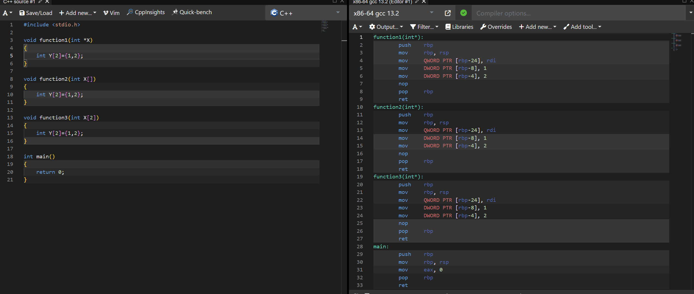
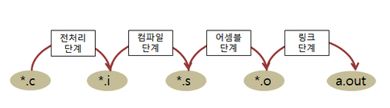

# 00. 개발 환경과 빌드

C 문법을 본격적으로 들어가기 전에, 소스 코드가 실행 파일이 되는 흐름과 개발 도구의 역할을 정리하는 준비 단원입니다.

처음 배우는 사람에게 필수 선행 문법은 아니지만, 컴파일 오류와 실행 흐름을 설명할 때 다시 꺼내 보기 좋은 자료입니다.

<table>
  <tr>
    <td align="center"> 컴파일</td>
    <td align="center"> 빌드 단계</td>
  </tr>
</table>

## 권장 학습 순서

| 순서 | 문서 | 내용 |
| --- | --- | --- |
| 1 | [빌드 과정](./01_빌드_과정.md) | 소스 코드가 실행 파일이 되는 전체 흐름 |
| 2 | [컴파일러 과정](./02_컴파일러_과정.md) | 컴파일 타임과 런타임의 차이 |
| 3 | [에디터](./03_에디터.md) | 코드 작성 환경과 개발 도구 |

## 다음 단원

준비 단원을 본 뒤에는 [01. C 기초](../01_C_기초/README.md)에서 자료형과 값 표현부터 학습합니다.
