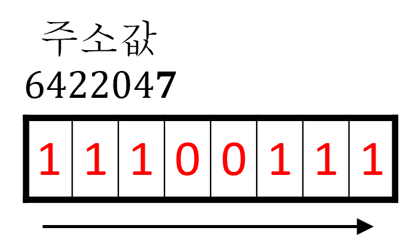

# 03. 불리언

<!-- EDUCATION-CONTEXT:START -->
<p align="right">
  <a href="../README.md">전체 목차</a> · <a href="./README.md">단원 목차</a>
</p>

## 학습 안내

> 단원: [01. C 기초](./README.md)  
> 이전 학습: [02. 정수 실수 문자](./02_정수_실수_문자.md)  
> 다음 학습: [04. 음수 표현](./04_음수_표현.md)

<p align="center">
  
</p>

### 학습 목표

- 불리언의 핵심 개념과 사용 목적을 설명할 수 있다.
- 예제 코드를 읽고 실행 흐름과 결과를 단계별로 추적할 수 있다.
- 이전 단원에서 배운 개념과 다음 단원에서 이어질 내용을 연결할 수 있다.

### 수업 흐름

1. bool
<!-- EDUCATION-CONTEXT:END -->

## **bool**

- True (참), False (거짓) 자료형

변수값

ⓐ true = 1

ⓑ false = 0

자료형 크기

＊ 1 Byte
- 라이브러리 `#include <stdbool.h>` 코드 추가 작성 후 사용

**f\_bool.c**

```c
#include <stdio.h>   // 라이브러리 → 함수 실행 코드들의 저장소
#include <stdbool.h> // 라이브러리 추가

void main() // 메인함수
{ // 메인 함수 시작
    bool A = true; // bool A:  bool 형태로 변수 A라는 이름으로 메모리박스 1개'선언'(메모리박스 내에 A라는 이름으로 입력/저장 공간 1개 할당)
                   // =: '동시에' 할당된 메모리박스 공간에 true를 사용하여 1이라는 정수로 '초기화'(입력/저장)
                   // → bool형 메모리박스 1개 '할당'하여 변수 값(= 1) '초기화'(입력/저장)
                   // → true에 마우스오버 시 1(= 참) 확인 가능  
    
    bool B = false; // bool B:  bool 형태로 변수 B라는 이름으로 메모리박스 1개'선언'(메모리박스 내에 B라는 이름으로 입력/저장 공간 1개 할당)
                    // =: '동시에' 할당된 메모리박스 공간에 false를 사용하여 0이라는 정수로 '초기화'(입력/저장)
                    // → bool형 메모리박스 1개 '할당'하여 변수 값(= 0) '초기화'(입력/저장)
                    // → false에 마우스오버 시 0(= 거짓) 확인 가능 

    // printf("%b", A);// 이와 같은 출력서식 없음
    
    printf("%d\n", A); // " "안의 '형태'로 출력해라(%d → 정수를 받아라, \n → 줄바꿈 해라):  %d 자리에 변수 A의 값(true = 1 = 정수)을 받아 출력하고 줄바꿈 해라
    printf("%d\n", B); // " "안의 '형태'로 출력해라(%d → 정수를 받아라, \n → 줄바꿈 해라):  %d 자리에 변수 A의 값(false = 0 = 정수)을 받아 출력하고 줄바꿈 해라
} // 메인 함수 끝
```

---
<!-- LESSON-NAV:START -->
[이전: 02. 정수 실수 문자](./02_정수_실수_문자.md) · [단원 목차](./README.md) · [다음: 04. 음수 표현](./04_음수_표현.md)
<!-- LESSON-NAV:END -->
