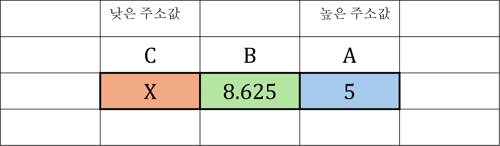
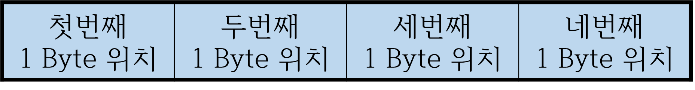

# 01. C 기초

C의 기본 자료형과 값 표현 방식을 다루는 첫 문법 단원입니다.

개발 환경과 빌드 흐름은 [00. 개발 환경과 빌드](../00_개발_환경과_빌드%28심화%29/README.md)로 분리했고, 이 단원은 정수, 실수, 문자, 불리언, 변수 범위를 차례대로 보는 흐름으로 정리했습니다.

<table>
  <tr>
    <td align="center"> 자료형</td>
    <td align="center"> 정수 표현</td>
    <td align="center"> 2의 보수</td>
    <td align="center"> 실수 표현</td>
  </tr>
</table>

## 권장 학습 순서

| 순서 | 문서 | 내용 |
| --- | --- | --- |
| 1 | [자료형](./01_자료형.md) | 자료형의 종류와 저장 방식 |
| 2 | [정수, 실수, 문자](./02_정수_실수_문자.md) | 기본 값 표현 |
| 3 | [불리언](./03_불리언.md) | 참/거짓과 조건 판단의 기초 |
| 4 | [음수 표현](./04_음수_표현.md) | 부호 있는 정수 표현 |
| 5 | [2의 보수](./05_2의_보수.md) | 컴퓨터가 음수를 저장하는 방식 |
| 6 | [실수 표현](./06_실수_표현.md) | 부동소수점과 표현 한계 |
| 7 | [변수 유효범위](./07_변수_유효범위.md) | 지역/전역 변수와 스코프 |

## 보조 자료

| 문서 | 내용 |
| --- | --- |
| [배열 보조 노트](./array.md) | 배열 단원과 연결되는 예비 자료 |
| [이전 README](./README_old.md) | 기존 정리본 백업 |

## 이미지 매칭 메모

`t`는 자료형, `i`와 `ivc`는 정수 표현, `tw`는 2의 보수, `f`는 실수 표현, `a`는 배열 보조 노트에 우선 연결합니다.
