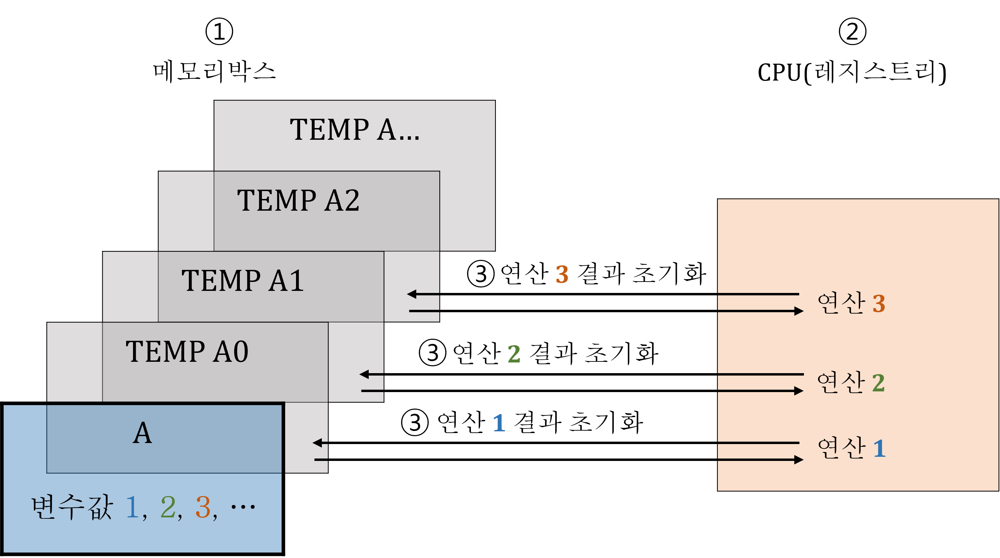

# 08. 논리 연산자

<!-- EDUCATION-CONTEXT:START -->
<p align="right">
  <a href="../README.md">전체 목차</a> · <a href="./README.md">단원 목차</a>
</p>

## 학습 안내

> 단원: [02. 입출력 및 연산자](./README.md)  
> 이전 학습: [07. 관계 연산자](./07_관계_연산자.md)  
> 다음 학습: [09. 비트 연산자](./09_비트_연산자.md)

<p align="center">
  
</p>

### 학습 목표

- 논리 연산자의 핵심 개념과 사용 목적을 설명할 수 있다.
- 예제 코드를 읽고 실행 흐름과 결과를 단계별로 추적할 수 있다.
- 이전 단원에서 배운 개념과 다음 단원에서 이어질 내용을 연결할 수 있다.

### 수업 흐름

1. Logical Operator 논리 연산자
<!-- EDUCATION-CONTEXT:END -->

## **Logical Operator 논리 연산자**

| && | (AND) | A && B |
| ---| ---| --- |
| || | (OR) | A || B |
| ! | (NOT) | A ! B |

```c
False = 0
True = 1
```

- 참고: 조건식: False = 0, True = 1
- 참고: 조건: False = 0, True = 0이아닌 나머지

**l\_1.c**

```c
#include <stdio.h>
// 변수 1개
// 선언 '동시' 초기화
int main ()
{
    int X = 3;        // 정수자료형      3(4 Bytes) → 선언 정수자료형 크기(4 Bytes) 만큼 입력/저장
    float Y = 0.125;  // 소수자료형  0.125(4 Bytes) → 선언 소수자료형 크기(4 Byts)  만큼 입력/저장
    char Z = 'I';     // 소수자료형      I(1 Byte)  → 선언 문자자료형 크기(1 Byte)  만큼 입력/저장

    printf("%d  %d  %d  %d\n", X == Y && X != Z, Z > X || Y < X, !(X >= Y), !(X <= Z)); // %d → flase = 0, true = 1 정수 표현
    // 문자 I ASCCI Code 변환 정수 73

    return 0;
}

// 선언 '후' 초기화
int main ()
{
    int X; 
    float Y;
    char Z;
    scanf("%d", &X); // %d 정수자료형     3(1 Byte) X 주소값(&)을 시작으로 입력/저장
    scanf("%f", &Y); // %f 소수자료형 0.125(1 Byte) Y 주소값(&)을 시작으로 입력/저장
    scanf("%c", &Z); // 엔터 입력/저장 공간
    scanf("%c", &Z); // %c 문자자료형     I(1 Byte) Z 주소값(&)을 시작으로 입력/저장

    printf("%d  %d  %d  %d\n", X == Y && X != Z, Z > X || Y < X, !(X >= Y), !(X <= Z)); // %d → flase = 0, true = 1 정수 출력
    // 문자 I ASCCI Code 변환 정수 73

    return 0;
}

// bool 자료형 이용
#include <stdio.h>
#include <stdbool.h>
int main()
{
    bool X = true; 
    bool Y = false; 
    bool Z;

    Z = X || Y; 
    
    printf("%d\n", X && Y); 
    printf("%d\n", X || Y);
    printf("%d\n", Z);

    printf("%d\n", !X);
    printf("%d\n", !Y);
    printf("%d\n", !Z);

    return 0;
}
```

**l\_2.c**

```c
#include <stdio.h>
// 배열
// 선언 '동시' 초기화
int main ()
{
    int X[3] = {3, 3, 3};                
    float Y[3] = {0.125, 0.125, 0.125};  
    char Z[3] = {'I', 'I', 'I'};         

    printf("%d  %d  %d  %d\n", X[1] == Y[2] && X[0] != Z[1], Z[2] > X[2] || Y[1] < X[0], !(X[0] >= Y[2]), !(X[1] <= Z[0])); // %d → flase = 0, true = 1 정수 출력
    // 문자 I ASCCI Code 변환 정수 73


    return 0;
}

// 선언 '후' 초기화
int main ()
{
    int X[3]; 
    float Y[3];
    char Z[3];
    for (int i = 0; i < 3; i++) 
    {
        scanf("%d", &X[i]);       // 예: i = 0 일때 3, i = 1 일때 3, i = 2 일때 3 입력/저장
    }
    for (int i = 0; i < 3; i++)
    {
        scanf("%f", &Y[i]);       // 예: i = 0 일때 0.125, i = 1 일때 0.125, i = 2 일때 0.125 입력/저장
    }
    scanf("%s", &Z);              // 예: III 입력/저장

    printf("%d  %d  %d  %d\n", X[1] == Y[2] && X[0] != Z[1], Z[2] > X[2] || Y[1] < X[0], !(X[0] >= Y[2]), !(X[1] <= Z[0])); // %d → flase = 0, true = 1 정수 출력
    // 문자 I ASCCI Code 변환 정수 73

    return 0;
}
```

---
<!-- LESSON-NAV:START -->
[이전: 07. 관계 연산자](./07_관계_연산자.md) · [단원 목차](./README.md) · [다음: 09. 비트 연산자](./09_비트_연산자.md)
<!-- LESSON-NAV:END -->
