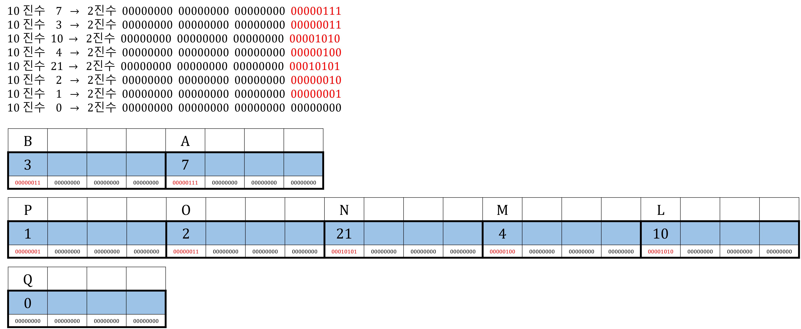

# 15. 연산자 강의

<!-- EDUCATION-CONTEXT:START -->
<p align="right">
  <a href="../README.md">전체 목차</a> · <a href="./README.md">단원 목차</a>
</p>

## 학습 안내

> 단원: [02. 입출력 및 연산자](./README.md)  
> 이전 학습: [05. 혼합 입출력](./05_혼합_입출력.md)  
> 다음 학습: [06. 산술 대입 연산자](./06_산술_대입_연산자.md)

<p align="center">
  
</p>

### 학습 목표

- 연산자 강의의 핵심 개념과 사용 목적을 설명할 수 있다.
- 예제 코드를 읽고 실행 흐름과 결과를 단계별로 추적할 수 있다.
- 이전 단원에서 배운 개념과 다음 단원에서 이어질 내용을 연결할 수 있다.

### 수업 흐름

1. Operator 연산자
2. Input 입력
<!-- EDUCATION-CONTEXT:END -->

## **C Language Learning Road Map**

> 데이터 형식 종류 ➝ 데이터 입력/출력 방식/원리 ➝ 다양한 처리과정


## **Operator 연산자**

컴퓨터가 해당언어(C Language)로 자료(Data)를 처리하는 방식

Arithmetic, Assignment, Type Conversion, Relational, Logical, Condition, Comma, Bitwise

Precondition 전제조건

\* Computing → Programme Code Processing Flow 프로그램 코드 실행 순서

`Window OS`

TEMP 작동 O → 주소값 관련
- scanf 함수 사용 시 시작 → &변수
- 배열 선언 시 시작 → 배열내 주소값 저장
- 증감 후위 연산 시 시작 → 변수 초기화 선행 (e.g. A++, A--)

### 연산 작동

### CPU 레지스트리 내 작동

```c
int 정수(2진수, 8진수, 16진수, 10진수) 기반
```

## **Input 입력**

`Window OS` (연산시) 왼쪽 ← 오른쪽 Compiling

- X 방식(TEMP 작동 O) = scanf 함수 사용 O(선언 '후' 초기화)

### 메모리박스 내 TEMP 초기화 O

- → 메모리박스 내 TEMP 0, TEMP 1, TEMP 2 ... 각각 초기화
- → TEMP 0, TEMP 1, TEMP 2 ... 초기화된 변수 메모리박스 내 각각 초기화

#### 예시

```c
int A;
scanf("%d", &A);
```

- 메모리박스 내 TEMP A0, TEMP A1, TEMP A2 ... 각각 초기화
- TEMP A0, TEMP A1, TEMP A2 ... 초기화된 변수 메모리박스 내 각각 초기화


#### 예시

```c
int A = 7 (정수)
```

- A++, A-- 증감 후위 연산자: 1) 초기화 '후' 2) 연산

- Y 방식(TEMP 작동 X) = scanf 함수 사용 X(선언 '동시' 초기화)

### 메모리박스 내 TEMP 초기화 X

- → 메모리박스 내 덮어쓰기 초기화
- → 최종 초기화된 변수 메모리박스 내 최종 초기화


#### 예시

```c
int A = 정수
```

- ++A, --A 증감 전위 연산자: 1) 연산 '후' 2) 초기화

**Case)**

증감 후위연산자 (A++, A--)

증감 전위연산자 (++A, --A)

대입 연산자 (A+=B, A-=B, A\*=B, A/B, A%B)

선언 '동시' 초기화 = scanf 함수 사용 X = Y 방식(TEMP 작동 X)

- 변수 1개

증감 후위연산자: X 방식(TEMP 작동 O)

증감 전위연산자: Y 방식(TEMP 작동 X)

증감 후위연산자: X 방식(TEMP 작동 O) + 증감 전위연산자: Y 방식(TEMP 작동 X)

대입 연산자: 없음 →Y 방식(TEMP 작동 X)

- 배열 X 방식(TEMP 작동 O)

증감 후위연산자: X 방식(TEMP 작동 O)

증감 전위연산자: Y 방식(TEMP 작동 X) → X 방식(TEMP 작동 O)

증감 후위연산자: X 방식(TEMP 작동 O) + 증감 전위연산자: X 방식(TEMP 작동 O)

대입 연산자: 없음 →X 방식(TEMP 작동 O)

선언 '후' 초기화 = scanf 함수 사용 O = X 방식(TEMP 작동 O)

- 변수 1개

증감 후위연산자: X 방식(TEMP 작동 O)

증감 전위연산자: Y 방식(TEMP 작동 X) → X 방식(TEMP 작동 O)

증감 후위연산자: X 방식(TEMP 작동 O) + 증감 전위연산자: X 방식(TEMP 작동 O)

대입 연산자: 없음 → X 방식(TEMP 작동 O)

- 배열 X 방식(TEMP 작동 O)

증감 후위연산자: X 방식(TEMP 작동 O)

증감 전위연산자: Y 방식(TEMP 작동 X) → X 방식(TEMP 작동 O)

증감 후위연산자: X 방식(TEMP 작동 O) + 증감 전위연산자: X 방식(TEMP 작동 O)

대입 연산자: 없음 → X 방식(TEMP 작동 O)

- 참고: `TEMP` 작동원리

하나라도 X 방식(TEMP 작동 O) in 초기화 Track → X 방식(TEMP 작동 O) 초기화

#### 예시

- 선언 '동시' 초기화 \[Y 방식(TEMP 작동 X)\]
- → 변수 갯수 1개
- → 증감 후위 연산자 \[X 방식(TEMP 작동 O)\]
- = X 방식(TEMP 작동 O) 초기화

#### 예시

- 선언 '동시' 초기화 \[Y 방식(TEMP 작동 X)\]
- → 배열 \[X 방식(TEMP 작동 O)\]
- → 증감 전위 연산자 \[Y 방식(TEMP 작동 X)\]
- = X 방식(TEMP 작동 O) 초기화


`Mac OS` 왼쪽 → 오른쪽 Compiling

X 방식(TEMP 작동 O)

* * *

---
<!-- LESSON-NAV:START -->
[이전: 05. 혼합 입출력](./05_혼합_입출력.md) · [단원 목차](./README.md) · [다음: 06. 산술 대입 연산자](./06_산술_대입_연산자.md)
<!-- LESSON-NAV:END -->
