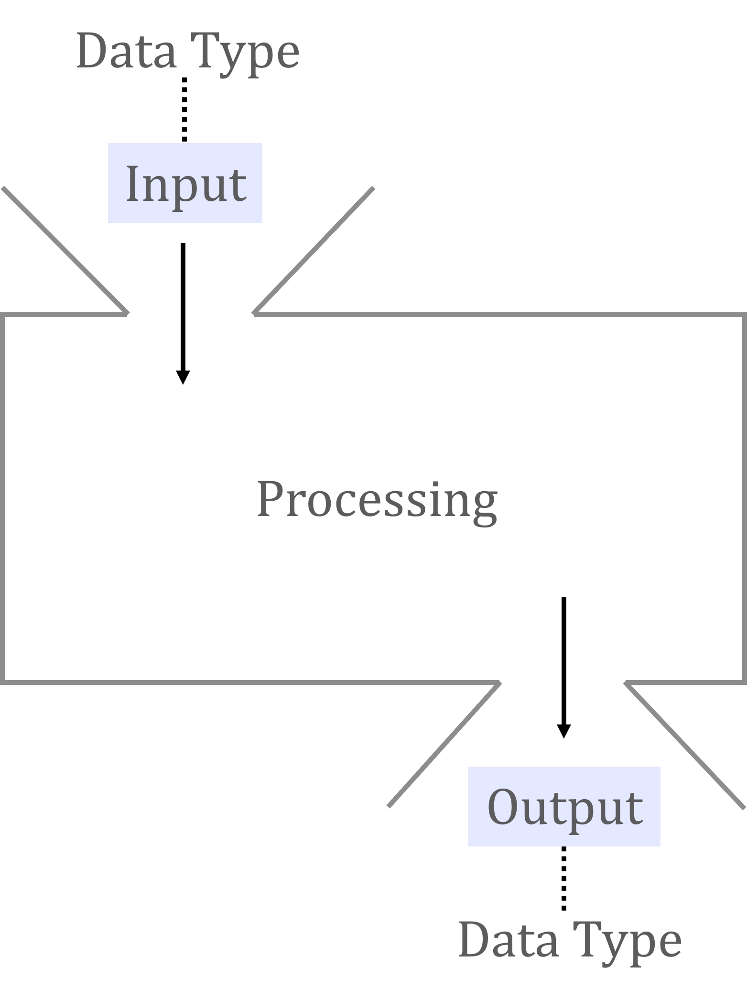
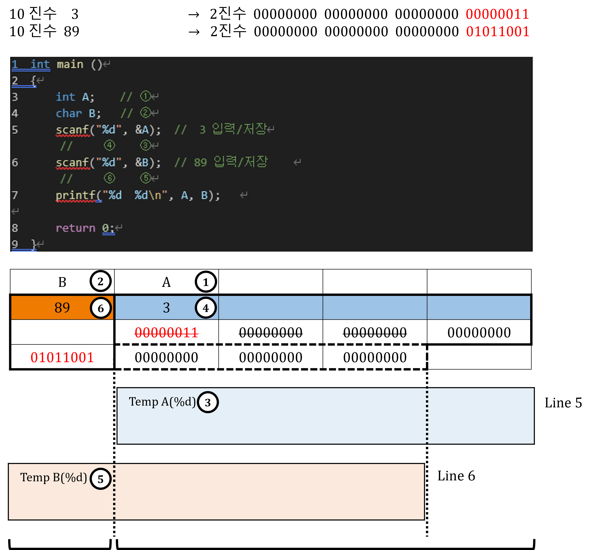
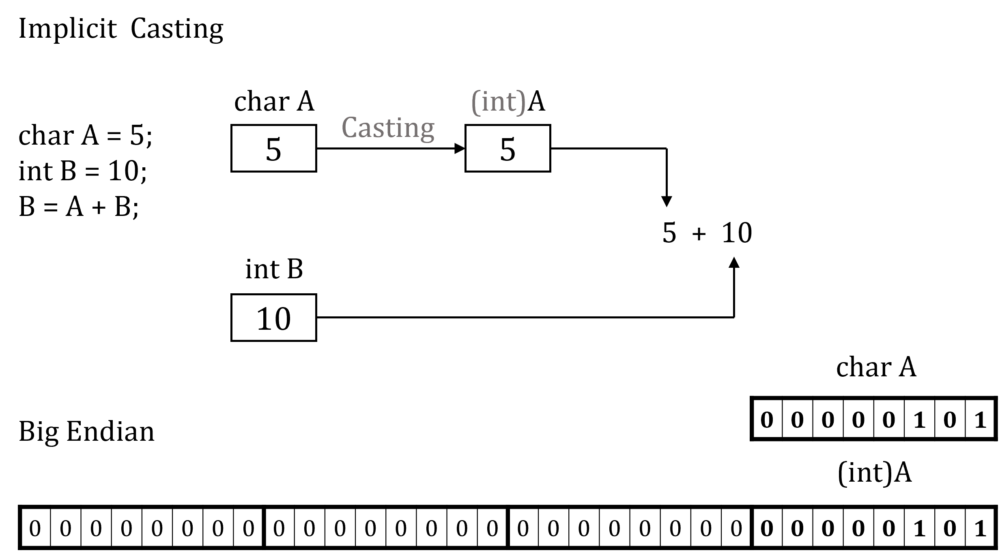
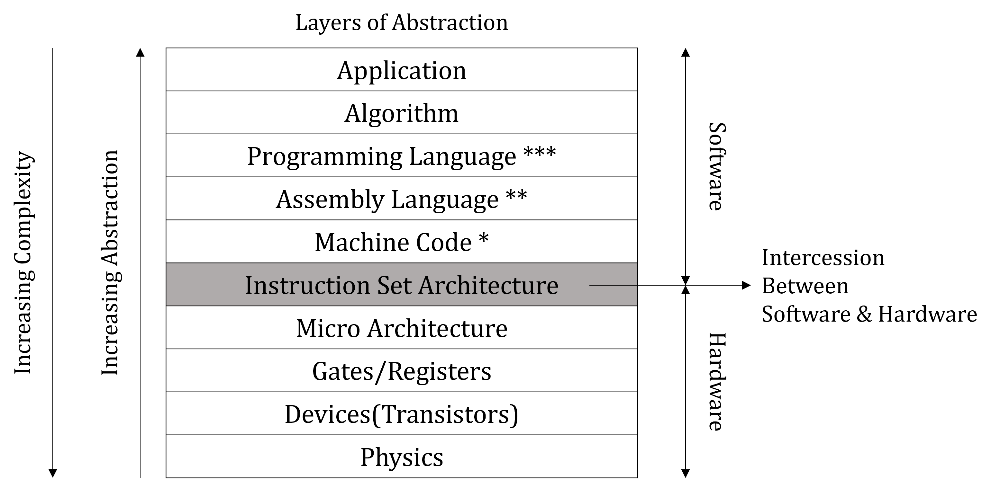

# 02. 입출력 및 연산자

C 프로그램이 외부에서 값을 받고, 그 값을 계산하거나 비교하는 방법을 다루는 단원입니다.

입출력 문법을 먼저 익힌 뒤 연산자, 형변환, 조건 판단으로 확장해 가는 순서로 보는 것이 좋습니다.

<table>
  <tr>
    <td align="center"> 입력과 출력</td>
    <td align="center"> 비교와 판단</td>
    <td align="center"> 형변환</td>
    <td align="center"> 컴퓨터 구조</td>
  </tr>
</table>

## 권장 학습 순서

| 순서 | 문서 | 내용 |
| --- | --- | --- |
| 1 | [기본 입출력](./01_기본_입출력.md) | `printf`, `scanf`의 기본 사용 |
| 2 | [자료형 입출력](./02_자료형_입출력.md) | 자료형별 서식 지정자 |
| 3 | [배열 입출력](./03_배열_입출력.md) | 배열 원소 입력과 출력 |
| 4 | [문자 배열 입출력](./04_문자_배열_입출력.md) | 문자열 입력과 문자 배열 |
| 5 | [혼합 입출력](./05_혼합_입출력.md) | 여러 자료형을 함께 입력받는 상황 |
| 6 | [연산자 강의](./15_연산자_강의.md) | 연산자 전체 로드맵 |
| 7 | [산술/대입 연산자](./06_산술_대입_연산자.md) | 계산과 값 갱신 |
| 8 | [관계 연산자](./07_관계_연산자.md) | 비교 결과와 참/거짓 |
| 9 | [논리 연산자](./08_논리_연산자.md) | 조건 결합 |
| 10 | [비트 연산자](./09_비트_연산자.md) | 비트 단위 조작 |
| 11 | [콤마 연산자](./10_콤마_연산자.md) | 식 평가 순서 |
| 12 | [조건 연산자](./11_조건_연산자.md) | 삼항 연산자 |
| 13 | [형변환](./12_형변환.md) | 묵시적/명시적 형변환 |
| 14 | [실수 이진 연산](./14_실수_이진_연산.md) | 실수 표현과 계산 오차 |
| 15 | [컴퓨터 구조와 임시변수](./13_컴퓨터_구조와_임시변수.md) | 식 계산 중 만들어지는 값 |
| 16 | [조건문 강의](./16_조건문_강의.md) | `if`, `switch`, 분기 흐름 |

## 이미지 매칭 메모

`IO`는 입출력, `R`은 관계 연산, `O`는 논리 연산, `CA`는 컴퓨터 구조와 임시변수, `Tc`는 형변환, `FPB`는 실수의 이진 표현 자료에 우선 연결해서 사용합니다. `A.png`처럼 주제와 맞지 않는 캡처는 대표 자료에서 제외했습니다.
