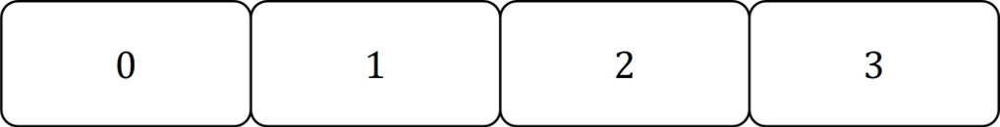
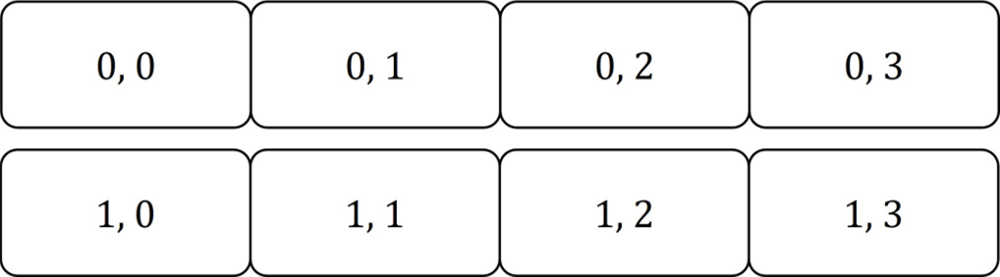
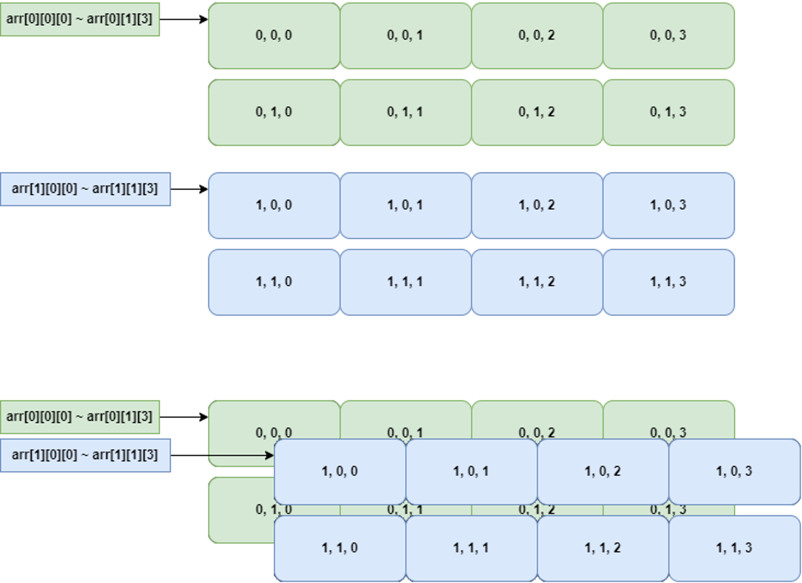

# 04. 배열과 문자열

여러 값을 연속된 메모리 공간에 저장하고, 인덱스로 접근하는 방법을 다루는 단원입니다.

문자열은 문자 배열의 특별한 사용 형태이므로, 1차원 배열의 메모리 구조를 먼저 잡고 다차원 배열로 확장합니다.

<table>
  <tr>
    <td align="center"> 1차원 배열</td>
    <td align="center"> 배열 구조</td>
    <td align="center"> 다차원 배열</td>
  </tr>
</table>

## 권장 학습 순서

| 순서 | 문서 | 내용 |
| --- | --- | --- |
| 1 | [1차원 배열](./01_1차원_배열.md) | 배열 선언, 인덱스, 순차 접근 |
| 2 | [다차원 배열](./02_다차원_배열.md) | 2차원 배열과 행/열 구조 |

## 수업 포인트

배열은 포인터 단원으로 넘어가는 다리입니다. 각 원소의 주소가 어떻게 증가하는지, `arr[i]`가 실제로 어떤 위치를 가리키는지 계속 확인하면서 보는 것이 좋습니다.
