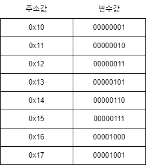

# 01. 포인터 강의

<!-- EDUCATION-CONTEXT:START -->
<p align="right">
  <a href="../README.md">전체 목차</a> · <a href="./README.md">단원 목차</a>
</p>

## 학습 안내

> 단원: [06. 포인터 기초](./README.md)  
> 이전 학습: [04. 함수 유용성](../05_함수/04_함수_유용성.md)  
> 다음 학습: [02. 포인터 기초](./02_포인터_기초.md)

<p align="center">
  
</p>

### 학습 목표

- 포인터 강의의 핵심 개념과 사용 목적을 설명할 수 있다.
- 예제 코드를 읽고 실행 흐름과 결과를 단계별로 추적할 수 있다.
- 이전 단원에서 배운 개념과 다음 단원에서 이어질 내용을 연결할 수 있다.

### 수업 흐름

1. Pointer 포인터
2. Ampersand Operator 주소/번지 연산자
3. Asterisk Operator 참조 연산자
<!-- EDUCATION-CONTEXT:END -->

## **C Language Learning Road Map**

> 데이터 형식 종류 ➝ 데이터 입력/출력 방식/원리 ➝ 다양한 처리과정


## **Pointer 포인터**

컴퓨터가 해당언어(C Language)로 자료(Data)를 처리하는 방식

&, \*

#### **Ampersand Operator 주소/번지 연산자**

`&` 앰퍼샌드/앤드

* 변수값: 메모리박스(RAM)에 초기화된 데이터
* 주소값: 변수값(데이터) 초기화 위치
  변수의 주소값 반환(Return)

.png)
변수값(데이터)의 주소값 = 해당 변수값(데이터)이 초기화된 메모리박스(RAM)의 "시작" 주소값

**a\_and.c**

```plain
#include <stdio.h>

int main()
{
    int A = 65;
    int B = 66;
    int C = 67;
    int D = 68;

    // 변수의 주소값을 다른 변수에 초기화
    int A_address = &A;
    int B_address = &B;
    int C_address = &C;
    int D_address = &D;

    // 주소값 10진수 출력  →  %d
    printf("%d\n", A_address); 
    printf("%d\n", B_address); 
    printf("%d\n", C_address); 
    printf("%d\n", D_address); 

    // 주소값 16진수 출력  →  %p
    printf("%p\n", A_address); 
    printf("%p\n", B_address); 
    printf("%p\n", C_address); 
    printf("%p\n", D_address); 

    return 0;
}
```

.png)

#### **Asterisk Operator 참조 연산자**

`*` 에스터리스크/스타 → 포인터

### 포인터 변수 선언 및 초기화

포인터 변수는 주소값을 초기화하기 위해 선언한 변수입니다.

- → 포인터 변수는 주소값 초기화 역할
- → 포인터 변수는 주소값의 영향력 범위 지정 역할
- = 주소값이 가르키는값/변수의 자료형 종류/크기 지정 역할

### 포인터와 포인터 변수 사용

- → 포인터+포인터 변수는 포인터 변수에 초기화된 주소값이 가르키는/참조하는 값/변수
- → 포인터+포인터 변수의 반환값(Return 값) = 주소값이 가르키는/참조하는 값/변수
- 참고: & 변수 = 주소값
- 참고: 포인터 변수 = & 변수 = 주소값
- 참고: 포인터+포인터 변수(\*포인터 변수) = 주소값이 가르키는/참조하는 값/변수
- 참고: 포인터 변수(= 주소값)보다 \*포인터 변수(= 주소값이 가르키는/참조하는 값/변수)는 한차원 ↓
- = 변수의 주소값 아래에 변수값이 초기화
- 핵심: 포인터 변수가 가르키는 값 = 초기화된 값(주소값)이 가르키는 값
- 따라서 초기화된 값(주소값)이 동일 ➝ 가르키는/참조하는 값/변수도 동일

#### 예시

```c
int X = 5; // ①  X는 변수: X는 int 변수
X = 5;
int *X_ptr = &X; // ②  X_ptr은 변수: X_ptr은 포인터 변수 → X_ptr은 int 포인터 변수
```

- → X\_ptr은 int \* 변수

```c
X_ptr = &X; // ③
*X_ptr = 5 = X; // ④ *X_ptr은 포인터+변수: *X_ptr은 포인터+포인터 변수(*포인터 변수)
//   X_ptr (= &X)보다 *X_ptr (= X = 5)는 한차원 아래
```

---
<!-- LESSON-NAV:START -->
[이전: 04. 함수 유용성](../05_함수/04_함수_유용성.md) · [단원 목차](./README.md) · [다음: 02. 포인터 기초](./02_포인터_기초.md)
<!-- LESSON-NAV:END -->
