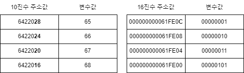
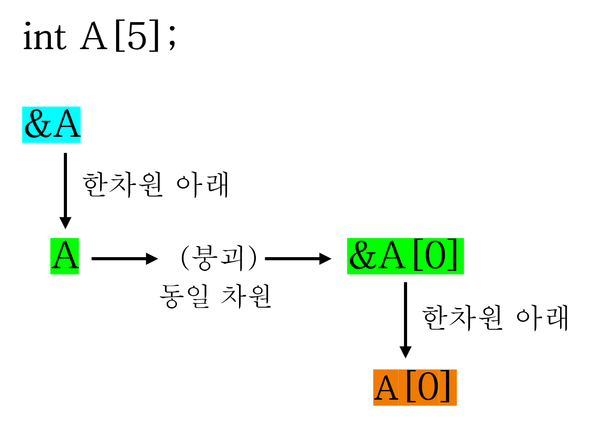
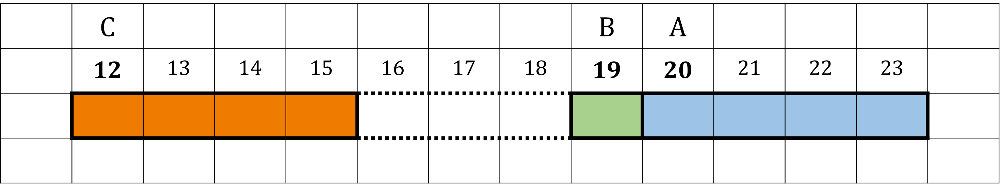

# 06. 포인터 기초

C에서 가장 중요한 개념 중 하나인 주소값과 간접 참조를 다루는 단원입니다.

포인터 자체를 따로 외우기보다 배열, 함수, 메모리 배치와 계속 연결해서 보는 것이 좋습니다.

<table>
  <tr>
    <td align="center"> 포인터</td>
    <td align="center"> 주소와 값</td>
    <td align="center"> 배열 변환</td>
    <td align="center"> 함수 연결</td>
  </tr>
</table>

## 권장 학습 순서

| 순서 | 문서 | 내용 |
| --- | --- | --- |
| 1 | [포인터 강의](./01_포인터_강의.md) | 포인터가 필요한 이유 |
| 2 | [포인터 기초](./02_포인터_기초.md) | 주소 연산자, 간접 참조, 포인터 변수 |
| 3 | [배열과 포인터 변환](./03_배열과_포인터_변환.md) | 배열 이름과 포인터의 관계 |
| 4 | [배열 전체 주소](./04_배열_전체_주소.md) | `arr`, `&arr[0]`, `&arr`의 차이 |
| 5 | [배열 포인터 비교 심화](./05_배열_포인터_비교_심화.md) | 배열 포인터와 포인터 연산 심화 |

## 이미지 매칭 메모

`P`는 포인터 도입, `ax`는 배열과 포인터 변환, `axxx`는 배열 포인터 심화, `icf`는 함수와 연결되는 포인터 예시에 우선 배치합니다.
