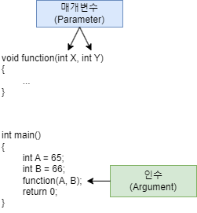
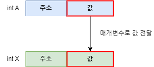
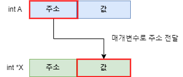

# 01. 함수 인자 기초

<!-- EDUCATION-CONTEXT:START -->
<p align="right">
  <a href="../README.md">전체 목차</a> · <a href="./README.md">단원 목차</a>
</p>

## 학습 안내

> 단원: [07. 함수 인자와 메모리](./README.md)  
> 이전 학습: [05. 배열 포인터 비교 심화](../06_포인터_기초/05_배열_포인터_비교_심화.md)  
> 다음 학습: [02. 값에 의한 전달](./02_값에_의한_전달.md)

<p align="center">
  
</p>

### 학습 목표

- 함수 인자 기초의 핵심 개념과 사용 목적을 설명할 수 있다.
- 예제 코드를 읽고 실행 흐름과 결과를 단계별로 추적할 수 있다.
- 이전 단원에서 배운 개념과 다음 단원에서 이어질 내용을 연결할 수 있다.

### 수업 흐름

1. Function 함수
2. Argument (인수) & Parameter (매개변수)
3. 3 Types of Parameter 매개변수 유형 3가지
4. Call by Value
5. 사용자정의 함수의 매개변수 = 일반 변수
6. Call by Address
<!-- EDUCATION-CONTEXT:END -->

## **Function 함수**

#### Argument (인수) & Parameter (매개변수)


- Argument 인수: A, B

정확히 A, B는 Local Variable 지역 변수

지역 변수의 값 65, 66이 Argument 인수

- Parameter 매개변수: X, Y

* * *

## **3 Types of Parameter 매개변수 유형 3가지**

- Call by Value

메인 함수(+ 사용자정의 함수)의 "Value 변수값"으로 사용자정의 함수 Call 호출

- Call by Address

메인 함수(+ 사용자정의 함수)의 "Address 주소값"으로 사용자정의 함수 Call 호출

- Call by Reference

메인 함수(+ 사용자정의 함수)의 "Reference 레퍼런스"로 사용자정의 함수 Call 호출

➝ Reference 레퍼런스 = 변수의 n개 별명 (i.e. 동일 변수를 다른이름으로 설정)

#### 예시

```c
int X, Y //  X, Y 다른변수 ➝(Reference 설정)➝ X, Y 이름은 다르지만 같은변수가 됨
```

- 참고: C++에만 존재하는 Data Type

* * *
* * *

## **Call by Value**

#### 사용자정의 함수의 매개변수 = 일반 변수

- 메인 함수의 Argument Value 인수"값"을 사용자정의 함수 Parameter 매개변수에 초기화(복사)
- 참고: 메인 함수의 Argument Value 인수값이 보존되어 있어 복사라고도 함
- Pros

초기화(복사)하기 때문에 안전

- = 메인 함수 지역 변수값 보존

- Cons

초기화(복사)하기 때문에 메모리(RAM) 사용량 증가 + 초기화(복사) 시간 발생

- = Code 실행 속도 감소

- 참고: Call by Value 초기화/복사

메모리박스 공간

- = 메인 함수의 Local Variable 지역 변수 공간 + 사용자정의 함수 Parameter 매개 변수 공간

➝ 사용자정의 함수 실행 종료후 할당 해제

#### 예시

- Local Variable 지역 변수 값 (Argument 인수 값) = A의 값
- Parameter 매개변수 = X


**func\_value\_1.c**

일반 변수

```c
#include <stdio.h>

void swap(int X, int  Y)                  
{
    int temp;
    temp =  X;                           // 파이썬은 한줄에 Swap Code 작성 가능   X = Y; 
    X = Y;
    Y = temp;

    printf("swap 함수: %d %d\n", X, Y);
}

int main()
{
    int A, B;
    A = 65;
    B = 66;
    printf("swap   전: %d %d\n", A, B);
    swap(A, B);
    printf("swap   후: %d %d\n", A, B);  // 사용자지정 함수의 매개변수 X, Y 값만 변경 →  메인 함수의 지역변수 A, B 값 보존/유지

    return 0;
}
```

### **실행 순서**

1. 메인 함수의 지역변수 A, B의 값(인수 65, 66)을 사용자정의 함수의 매개변수 X, Y에 초기화(복사)
2. swap 함수 실행
- 사용자정의 함수의 매개변수 X, Y값 변경: X = 65, Y = 66 ➝ X = 66, Y = 65
3. swap 함수 종료
- 메인 함수의 지역변수 A, B값 보존: A = 65, B = 66
- 따라서 사용자정의 함수의 매개변수 = 지역변수(Local Variable)
- ➝ auto: automatic duration + no linkage


**func\_value\_2.c**

배열
- 배열 X ➝(붕괴 O)➝ &X\[0\]이므로 매개변수에 "값" 초기화(복사) 가능 X = Call by Value 가능 X
- X\[n\] 요소를 각각 매개변수로 전달 가능 O

* * *

## **Call by Address**
#### 사용자정의 함수의 매개변수 = 포인터 변수

- 메인 함수의 Argument Value 인수"값"을 사용자정의 함수의 Parameter에 초기화(복사)

### ➝ Address 주소값

- = 메인 함수의 지역 변수의 "주소값"을 사용자정의 함수의 매개변수(포인터변수)에 초기화(복사)
- Pros

아래 ( ) 참조

- Cons

아래 ( ) 참조

#### 예시

- Local Variable 지역 변수 값 (Argument 인수 값) = A의 주소값
- Parameter 매개변수 = X

- 메인 함수의 지역 변수 A의 주소값(&A)을 사용자정의 함수의 매개변수 X에 초기화(복사)
- 사용자정의 함수의 매개변수에 초기화된 주소값으로 메인 함수의 지역변수 값 접근 ➝ 변경 가능

**func\_address\_1.c**

일반 변수

```c
#include <stdio.h>

void swap(int *X, int *Y)  // X = &A, Y = &B 
{
    int temp;
    temp = *X;             
    *X = *Y;               
    *Y = temp;             

    printf("swap 함수: %d %d\n", *X, *Y);
}

int main()
{
    int A, B;
    A = 65;
    B = 66;
    int *A_ptr = &A;
    int *B_ptr = &B;

    printf("swap   전: %d %d\n", A, B);    
    swap(A_ptr, B_ptr);                   // swap(&A, &B);
    printf("swap   후: %d %d\n", A, B);   // 사용자정의 함수 실행 ➝ 메인 함수의 지역 변수 A, B의 주소값에 접근해서 값변경   ∴ 메인함수의 지역 변수 A, B 값 보존 X 
    
    return 0;
}
```

### **실행 순서**

1. 메인 함수의 지역변수 A, B의 주소값(포인터변수 A\_ptr, B\_ptr = &A, &B)을

### 사용자지정 함수의 매개변수 X, Y에 초기화(복사)

2. swap 함수 실행

### 사용자지정 함수의 매개변수 \*X, \*Y값 변경:

```c
*X = A값(= 65), *Y = B값(= 66) ➝(변경)➝ *X = B값(= 66), *Y = A값(= 65)
```

3. swap 함수 종료
- 메인 함수의 지역변수 A, B값 변경: A = 66, B = 65
- 이유: 사용자정의 함수 실행 ➝ 메인 함수의 지역 변수 A, B의 주소값에 접근해서 값변경
- 따라서 메인함수 지역 변수 A, B 값 변경 O (메인함수의 지역 변수 A, B 값 보존 X)


### **func\_address\_2.c**

### 일반 변수

- 참고: 사용자정의 함수 사용하지 않고 주소값에 접근해 (주소값 아래에 초기화된)변수값 변경한 경우

```c
#include <stdio.h>

int main()
{
    int A = 65;
    char B = 'A';
    float C = 8.625;

    // int 변수 주소값을 A_address에 초기화
    // char 변수의 주소값을 B_address에 초기화
    // float 변수의 주소값을 C_address에 초기화
    int *A_address;   
    char *B_address;  
    float *C_address; 
    A_address = &A;
    B_address = &B;
    C_address = &C;

    printf("A 포인터가 가르키는 값: %d\n", *A_address);
    printf("B 포인터가 가르키는 값: %c\n", *B_address);
    printf("C 포인터가 가르키는 값: %f\n", *C_address);
    printf("=================================\n");

    *A_address = 66;      // *A_address(포인터 A_address) = A(주소값이 가르키는 변수)  →  A = 65  ≒  65(주소값에 초기화된 값):  *A_address = A
    *B_address = 'B';
    *C_address = 0.625;

    printf("A 포인터가 가르키는 값: %d\n", *A_address);
    printf("B 포인터가 가르키는 값: %c\n", *B_address);
    printf("C 포인터가 가르키는 값: %f\n", *C_address);
    printf("=================================\n");

    printf("변경된 A값: %d\n", A);
    printf("변경된 B값: %c\n", B);
    printf("변경된 C값: %f\n", C);

    return 0;
}
```

**func\_address\_3.c**

배열

* * *

## **Call by Reference**
#### 사용자정의 함수의 매개변수 = 레퍼런스 변수

- 메인 함수의 Local Variable 통채를("변수값 + 주소값") 사용자정의 함수의 Parameter에 초기화(복사)

### ≒ Call by Value + Call by Address

- 메인 함수의 지역 변수 Local Variable = 사용자정의 함수의 매개변수 Parameter
- = 메인 함수의 지역 변수 Local Variable와 사용자정의 함수의 매개변수 Parameter가 "완전히" 동일
- = 메인 함수의 지역 변수 Local Variable와 사용자정의 함수의 매개변수 Parameter가 실제 "동기화"
- 따라서 
- 메인 함수 변수의 변수값 = 사용자정의 함수의 매개변수의 변수값
- 메인 함수 변수의 주소값 = 사용자정의 함수의 매개변수의 주소값
- 참고: 
- 메인 함수 Local Variable 지역 변수 변수값은 사용자정의 함수에 따라 "보존 or 변경" 가능 O
- 이유: Call by Address 특징 내재
- 사용자정의 함수 실행 ➝ 메인 함수의 지역 변수 A, B의 주소값에 접근해서 A, B 값변경 O
- Cf)
- Call by Reference와 Call by Address의 변경 방법은 상이
- 이유: Call by Address는 주소값에 접근하여 변수값 변경
- 이유: Call by Reference는 변수값 자체를 변경 (결국 별명이 다른 다같은 동일 변수이기 때문)

- Pros

초기화(복사)하지 않고 직접 참조

변수 자체를 변경

- = 별명이 n개인 다같은 "동일" 변수

- = 별명이 n개인 "1개" 변수

- = 불리는 이름이 다를뿐 본인은 1명으로 변하지 않음

Code 실행 속도 증가

- Cons

직접 참조하기 때문에 실제 변수값이 변경이 되어버림 O

- = 메인 함수의 실제 Local Variable 지역 변수 값 보존 X

- 이유: 메인 함수의 지역 변수와 사용자정의 함수의 매개변수가 실제로 "동기화" 되어 있음

i.e.)

어떤 변수가 언제/어떻게 초기화 되었는지 확인할 것이 많음

변수 A를 Call by Reference로 실행하는 사용자정의 함수가 여러개 있을때(매개변수가 X, Y, Z)

어떤 사용자정의 함수에서 A 값이 변경되었는지 확인하려면 모든 함수 확인 필요 O

- 따라서 Debugging 단계에서 Error 검출 어려움

- 참고: C++ 기능 O (C 기능 X)

`자료형 &변수명`: Reference 자료형 선언 방법 (E.g. int &X)

**func\_reference\_1.cpp**

```c
#include <stdio.h>

void swap(int &X, int &Y)          // X = A의 65 + &A, Y = B의 66 + &B
{                                  // 실제로 동기화로 인해 X 주소값 = A 주소값, Y 주소값 = B 주소값
    int temp;                      // 5~8번째줄: X, Y 주소값"은" 유지 + 변수값"만" 변경
    temp = X;                       
    X = Y;
    Y = temp;

    printf("X의 주소: %d\n", &X);
    printf("Y의 주소: %d\n", &Y);
    printf("X의   값: %d\n", X);
    printf("Y의   값: %d\n", Y);
}

int main()
{
    int A, B;
    A = 65;
    B = 66;
    printf("A의 주소: %d\n", &A);
    printf("B의 주소: %d\n", &B);

    printf("swap  전: %d %d\n", A, B);
    swap(A, B);
    printf("swap  후: %d %d\n", A, B);  // 사용자정의 함수의 Reference 자료형으로 인해 메인 함수의 변수와 사용자정의 함수 매개변수가 동기화
                                        // ∴ 메인 함수의 변수값 변경
    
    return 0;
}
```


**func\_reference\_2.cpp**

```c
// Case #1
#include <stdio.h>

void swap(int X, int Y)            // X = A의 65 + &A, Y = B의 66 + &B
{                                  // 실제로 동기화로 인해 X 주소값 = A 주소값, Y 주소값 = B 주소값
    int temp;                      // 5~8번째줄: X, Y 주소값"은" 유지 + 변수값"만" 변경
    temp = X;                       
    X = Y;
    Y = temp;

    printf("X의 주소: %d\n", &X);
    printf("Y의 주소: %d\n", &Y);
    printf("X의   값: %d\n", X);
    printf("Y의   값: %d\n", Y);
}

int main()
{
    int &A, &B;
    A = 65;
    B = 66;
    // int &A = 65;
    // int &B= 66;

    printf("A의 주소: %d\n", &A);
    printf("B의 주소: %d\n", &B);

    printf("swap  전: %d %d\n", A, B);
    swap(A, B);
    printf("swap  후: %d %d\n", A, B);  // 사용자정의 함수의 Reference 자료형으로 인해 메인 함수의 변수와 사용자정의 함수 매개변수가 동기화
                                        // ∴ 메인 함수의 변수값 변경
    
    return 0;
}
// 결과:  Compiling Error
// 원인:
// 레퍼런스는 상수값으로 초기화할 수 없음
// 레퍼런스는 선언 및 초기화 동시에"만" 가능


// Case #2
#include <stdio.h>

void swap(int X, int Y)            // X = A의 65 + &A, Y = B의 66 + &B
{                                  // 실제로 동기화로 인해 X 주소값 = A 주소값, Y 주소값 = B 주소값
    int temp;                      // 5~8번째줄: X, Y 주소값"은" 유지 + 변수값"만" 변경
    temp = X;                       
    X = Y;
    Y = temp;

    printf("X의 주소: %d\n", &X);
    printf("Y의 주소: %d\n", &Y);
    printf("X의   값: %d\n", X);
    printf("Y의   값: %d\n", Y);
}

int main()
{
    int C, D;
    int &A = C;
    int &B = D;
    C = 65;
    D = 66;
  
    printf("A의 주소: %d\n", &A);
    printf("B의 주소: %d\n", &B);

    printf("swap  전: %d %d\n", A, B);
    swap(A, B);
    printf("swap  후: %d %d\n", A, B);  // 사용자정의 함수의 Reference 자료형으로 인해 메인 함수의 변수와 사용자정의 함수 매개변수가 동기화
                                        // ∴ 메인 함수의 변수값 변경
    
    return 0;
}
// 결과:  A, B 주소값  ≠  X, Y 주소값   →   1) 변수 A, B가 X, Y의 레퍼런스(별명)아 아님  +  2) X, Y는 지역변수이기 때문에 swap이 된 X, Y값은 사용자정의함수 실행 종료후 해제
// 원인:
// 레퍼런스(별명) 선언이  실제 변수 선언 이후에 해야함
// &A, &B 선언이 X, Y 선언 이후에 해야함
```

- 참고: Reference Data Type 선언 및 초기화

| int A = 10;                                                                     | O   | \-                                           |
| ------------------------------------------------------------------------------- | --- | -------------------------------------------- |
| int &B = 10;                                                                    | X   | ★ Reference는 상수값으로 초기화 할 수 없음   |
| int &C = A;                                                                     | O   | \-                                           |
| int &D;                                                                         | X   | ★ Reference는 선언 및 초기화 동시에"만" 가능 |
| Reference(별명) 선언은 실제 변수 선언 이후에 해야 Reference(별명) 기능이 작동 O |

* * *

#### 메인 함수의 지역변수 Local Variable & 사용자정의 함수의 매개변수 Parameter

- Call by Value

메인 함수 변수의 주소값 ≠ 사용자정의 함수의 매개변수의 주소값

메인 함수 변수의 변수값 = 사용자정의 함수의 매개변수의 변수값

➝ 변수값 = int, float, char

- Call by Address

메인 함수 변수의 주소값 ≠ 사용자정의 함수의 매개변수의 주소값

메인 함수 변수의 변수값 = 사용자정의 함수의 매개변수의 변수값

➝ 변수값 = Address 주소값

- Call by Reference

메인 함수 변수의 주소값 = 사용자정의 함수의 매개변수의 주소값

메인 함수 변수의 변수값 = 사용자정의 함수의 매개변수의 변수값

➝ 변수값 = int, float, char or Address 주소값

- 참고: 아래 **d\_pointer\_func\_3c.cpp** \> // Parameter #2: Pointer + Reference Data Type

**func\_pointer\_1.cpp**

```c
// Parameter #1:  Pointer + Address Data Type 
#include <stdio.h>

void swap(int *X, int *Y)  // X = &A, Y = &B 
{
    int temp;
    temp = *X;             
    *X = *Y;               
    *Y = temp;             

    printf("swap 함수: %d %d\n", *X, *Y);
}

int main()
{
    int A, B;
    A = 65;
    B = 66;
    int *A_ptr = &A;
    int *B_ptr = &B;

    printf("swap   전: %d %d\n", A, B);    
    swap(A_ptr, B_ptr);                   // swap(&A, &B);
    printf("swap   후: %d %d\n", A, B);   // 사용자정의 함수 실행 ➝ 메인 함수의 지역 변수 A, B의 주소값에 접근해서 값변경   ∴ 메인함수의 지역 변수 A, B 값 보존 X 
    
    return 0;
}


// Parameter #2:  Pointer + Referecne Data Type 
#include <stdio.h>

void swap(int *&X, int *&Y)  //  X = &A, Y = &B 
{
    int temp;
    temp = *X;             
    *X = *Y;               
    *Y = temp;             

    printf("swap 함수: %d %d\n", *X, *Y);
}

int main()
{
    int A, B;
    A = 65;
    B = 66;
    int *A_ptr = &A;
    int *B_ptr = &B;

    printf("swap   전: %d %d\n", A, B);    
    swap(A_ptr, B_ptr);                   // swap(&A, &B);
    printf("swap   후: %d %d\n", A, B);   // 사용자정의 함수 실행 ➝ 메인 함수의 지역 변수 A, B의 주소값에 접근해서 값변경   ∴ 메인함수의 지역 변수 A, B 값 보존 X 
    
    return 0;
}
```

**func\_pointer\_2.cpp**

```c
// Case #1
#include <stdio.h>

void swap(int X, int Y)
{            
    int temp;                       
    temp = X;                       
    X = Y;
    Y = temp;

    printf("X의 주소: %d\n", &X);
    printf("Y의 주소: %d\n", &Y);
    printf("X의   값: %d\n", X);
    printf("Y의   값: %d\n", Y);
}

int main()
{
    int C, D;
    int &A = C;
    int &B = D;
    C = 65;
    D = 66;
    // int E, F;                        // 메인함수에서 레퍼런스의 레퍼런스는 안됨
    // int &E = A;
    // int &F = B;
  
    printf("A의 주소: %d\n", &A);
    printf("B의 주소: %d\n", &B);

    printf("swap  전: %d %d\n", A, B);
    swap(A, B);
    printf("swap  후: %d %d\n", A, B);  
    
    return 0;
}

// Case #2
#include <stdio.h>

void swap(int &X, int Y)
{            
    int temp;                       
    temp = X;                       
    X = Y;
    Y = temp;

    int &Z = X;                        // 사용자정의 함수에서 레퍼런스의 레퍼런스는 됨
 
    printf("X의 주소: %d\n", &X);
    printf("Y의 주소: %d\n", &Y);
    printf("X의   값: %d\n", X);
    printf("Y의   값: %d\n", Y);
}

int main()
{
    int C, D;
    int &A = C;
    int &B = D;
    C = 65;
    D = 66;                             
    // int E, F;                        
    // int &E = A;
    // int &F = B;
  
    printf("A의 주소: %d\n", &A);
    printf("B의 주소: %d\n", &B);

    printf("swap  전: %d %d\n", A, B);
    swap(A, B);
    printf("swap  후: %d %d\n", A, B);                               
    
    return 0;
}
// 관건 1: 레펀런스(별명) 대체 원리(언제/어떻게)
// 관건 2: 함수에서 매개변수 할당/초기화 원리(언제/어떻게)
```

Notice #1

Reference 레퍼런스 (별명 Nick Name) 대체/작동 원리 → When & How

Notice #2

Function 함수에서 Parameter 매개변수 할당/초기화 원리 → When & How

* * *
* * *

---
<!-- LESSON-NAV:START -->
[이전: 05. 배열 포인터 비교 심화](../06_포인터_기초/05_배열_포인터_비교_심화.md) · [단원 목차](./README.md) · [다음: 02. 값에 의한 전달](./02_값에_의한_전달.md)
<!-- LESSON-NAV:END -->
