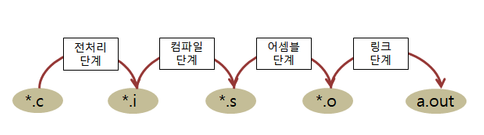
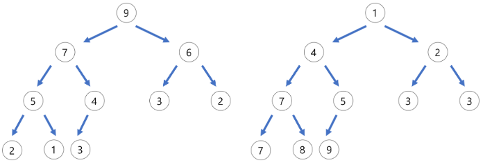

# 07. 함수 인자와 메모리

함수 호출 시 값이 어떻게 전달되고, 메모리에서 어떤 차이가 생기는지 다루는 단원입니다.

값에 의한 전달, 주소에 의한 전달, 참조에 의한 전달을 비교하면서 스택/힙 메모리 구조로 확장합니다.

<table>
  <tr>
    <td align="center"> Call by Value</td>
    <td align="center"> Call by Address</td>
    <td align="center"> 컴파일/런타임</td>
    <td align="center"> 메모리 구조</td>
  </tr>
</table>

## 권장 학습 순서

| 순서 | 문서 | 내용 |
| --- | --- | --- |
| 1 | [함수 인자 기초](./01_함수_인자_기초.md) | 인수와 매개변수 |
| 2 | [값에 의한 전달](./02_값에_의한_전달.md) | 복사된 값이 전달되는 방식 |
| 3 | [주소에 의한 전달 - 매개변수](./03_주소에_의한_전달_매개변수.md) | 포인터 매개변수 |
| 4 | [주소에 의한 전달 - 반환](./04_주소에_의한_전달_반환.md) | 포인터 반환 |
| 5 | [주소에 의한 전달 - 일반](./05_주소에_의한_전달_일반.md) | 주소 전달 종합 |
| 6 | [참조에 의한 전달](./06_참조에_의한_전달.md) | 참조 전달 개념 비교 |
| 7 | [메모리 컴파일 런타임](./07_메모리_컴파일_런타임.md) | 컴파일 타임과 런타임 메모리 |
| 8 | [메모리 구조와 관리](./08_메모리_구조와_관리.md) | 스택, 힙, 정적 영역 |
| 9 | [배열 반환](./09_배열_반환.md) | 배열과 포인터 반환의 주의점 |
| 10 | [동적 메모리 반환](./10_동적_메모리_반환.md) | 동적 할당 메모리와 수명 |

## 이미지 매칭 메모

`CBV`는 값 전달, `CBA`는 주소 전달, `mcr`은 컴파일/런타임 구분, `mms`는 메모리 구조 설명에 우선 연결합니다.
