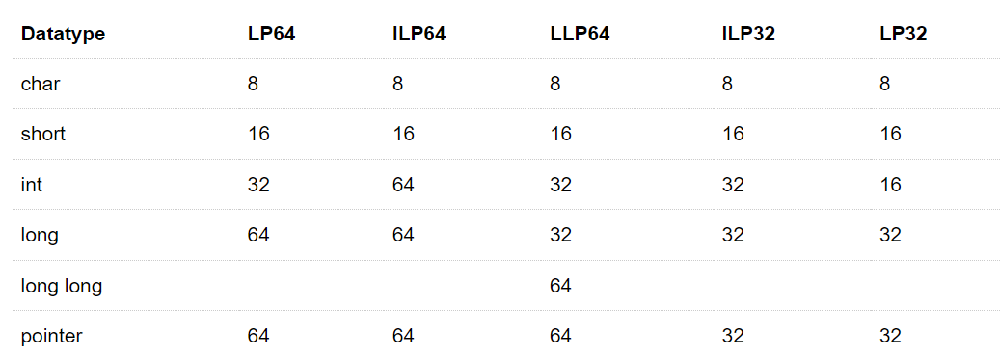

# 03. 함수 포인터 활용2

<!-- EDUCATION-CONTEXT:START -->
<p align="right">
  <a href="../README.md">전체 목차</a> · <a href="./README.md">단원 목차</a>
</p>

## 학습 안내

> 단원: [08. 함수 포인터와 고급](./README.md)  
> 이전 학습: [02. 함수 포인터 활용1](./02_함수_포인터_활용1.md)  
> 다음 학습: [04. 함수 포인터 활용3](./04_함수_포인터_활용3.md)

<p align="center">
  
</p>

### 학습 목표

- 함수 포인터 활용2의 핵심 개념과 사용 목적을 설명할 수 있다.
- 예제 코드를 읽고 실행 흐름과 결과를 단계별로 추적할 수 있다.
- 이전 단원에서 배운 개념과 다음 단원에서 이어질 내용을 연결할 수 있다.

### 수업 흐름

1. Usage #2 용도 #2
<!-- EDUCATION-CONTEXT:END -->

## **Usage #2 용도 #2**

함수 포인터 변수는

함수 포인터 변수에 초기화된 주소값에 해당하는 다른 함수를 실행

**fptr\_us1\_3.c**
- 함수 포인터 변수는

함수 포인터 변수에 초기화된 주소값에 해당하는 다른 함수를 실행

- 함수 자료형 및 매개 변수 갯수 #2

: int func( );

함수 포인터 변수 자료형 및 매개 변수 갯수 #2

: int (\*func\_ptr)( );

```c
#include <stdio.h>

int version1_info()
{
    printf("version 1 app\n");
    return 0;
}

int version2_info()
{
    printf("version 2 app\n");
    return 0;
}

int main()
{
    int (*info_function_ptr)();   // 함수 포인터변수 선언 형식
    int version = 0;

    while (1)
    {
        printf("input version\n");
        scanf("%d", &version);

        if (version == 1)
        {
            info_function_ptr = version1_info; // info_function_ptr = version1_info
            break;
        }
        else if (version == 2)
        {
            info_function_ptr = version2_info; // info_function_ptr = version2_info
            break;
        }
        else
        {
            printf("wrong version\n");
        }
    }
    info_function_ptr();
}
```

**fptr\_us1\_4.c**
- 함수 포인터 변수는

함수 포인터 변수에 초기화된 주소값에 해당하는 다른 함수를 실행

- 함수 포인터 배열 변수

`void (*function_ptr_arr[n])();`

1. 함수 선언

- 예: , `void function1();`

- 예: , `void function2();`

2. 함수 포인터 변수 선언

- 예: , `void (*function_ptr_arr[n])();`

3. 함수 주소값 초기화

- 예: , `function_ptr_arr[0] = function1;`

- 예: , `function_ptr_arr[1] = function2;`

```c
#include <stdio.h>

// 함수
void function1()
{
    printf("version 1 app\n");
    return;
}

void function2()
{
    printf("version 2 app\n");
    return;
}

int main()
{
    void (*function_ptr_arr[2])();
    function_ptr_arr[0] = function1;
    function_ptr_arr[1] = function2;

    function_ptr_arr[0]();
    function_ptr_arr[1]();
}
```

**fptr\_us1\_5.c**
- 함수 포인터 변수는

함수 포인터 변수에 초기화된 주소값에 해당하는 다른 함수를 실행

- 함수 배열 포인터 변수 응용 

```c
#include <stdio.h>

// 함수 1
void kakao_send_msg()
{
    printf("kakao\n");
    printf("kakao bell\n");
    printf("kakao message\n");
    return;
}

// 함수 2
void line_send_msg()
{
    printf("line\n");
    printf("line_bell\n");
    printf("line message\n");
    return;
}

// 함수 3
void sms_send_msg()
{
    printf("sms_bell\n");
    printf("sms message\n");
    return;
}

void send_sms(int app_num)
{
    if (app_num == 0)
        kakao_send_msg();
    else if (app_num == 1)
        line_send_msg();
    else if (app_num == 2)
        sms_send_msg();
    else
        printf("error\n");
    return;
}

int main()
{
    int X;
    scanf("%d", &X);

    send_sms(X);
}
```

↓

**fptr\_us1\_6.c**
- 함수 포인터 변수는

함수 포인터 변수에 초기화된 주소값에 해당하는 다른 함수를 실행

- 함수 배열 포인터 변수 응용 

```c
#include <stdio.h>
#include <stdbool.h>

void (*send_funptr_arr[3])();

// 함수 1
void kakao_send_msg()
{
    printf("kakao\n");
    printf("kakao bell\n");
    printf("kakao message\n");
    return;
}

// 함수 2
void line_send_msg()
{
    printf("line\n");
    printf("line_bell\n");
    printf("line message\n");
    return;
}

// 함수 3
void sms_send_msg()
{
    printf("sms_bell\n");
    printf("sms message\n");
    return;
}

bool send_sms(int app_num)
{
    if (app_num != 0 && app_num != 1 && app_num != 2)
    {
        printf("Error\n");
        return false;
    }

    send_funptr_arr[app_num]();
    return true;
}

int main()
{
    int X;

    // void (*send_funptr_arr[3])();    // 여기 위치하면, 34번재줄 실행 Error

    send_funptr_arr[0] = kakao_send_msg;
    send_funptr_arr[1] = line_send_msg;
    send_funptr_arr[2] = sms_send_msg;

    while (1)
    {
        scanf("%d", &X);
        if (send_sms(X))
        {
            break;
        }
    }
    
    return 0;
}
```

1. 코드 단순화 ➝ send\_sms 함수
2. 기능적으로 callback 함수와 유사

---
<!-- LESSON-NAV:START -->
[이전: 02. 함수 포인터 활용1](./02_함수_포인터_활용1.md) · [단원 목차](./README.md) · [다음: 04. 함수 포인터 활용3](./04_함수_포인터_활용3.md)
<!-- LESSON-NAV:END -->
